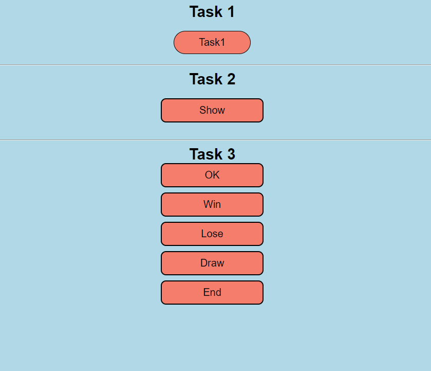

# Homework 3

## Bài 1

Tạo component div và truyền props color / shape cho nó

## Bài 2

Tạo button giúp show/hide 1 text component

## Bài 3

Tạo button. Khi click vào button sẽ alert ra text bên trong button đó

## Screenshot

